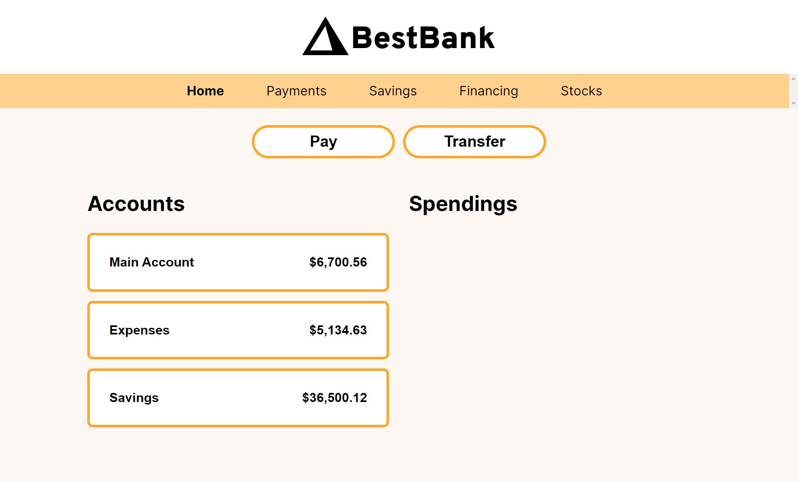
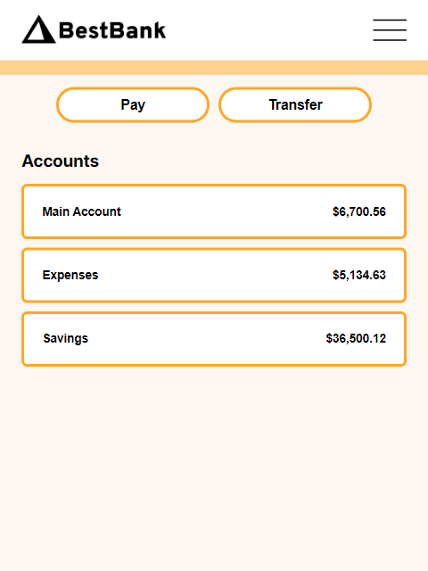
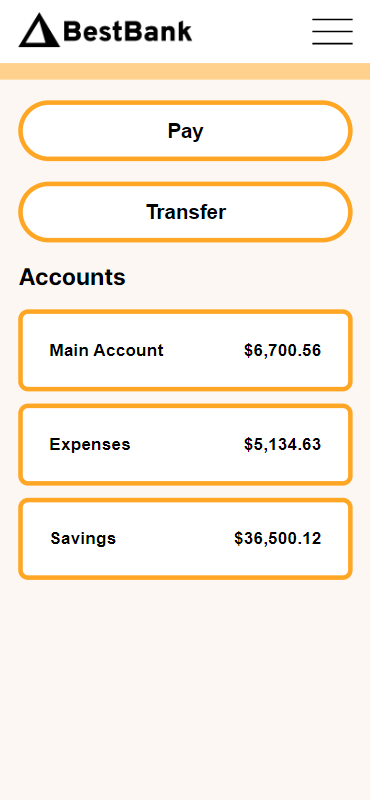

# Best Bank

A web app that has the power to check your Accounts' information as well as how much has been spent in each account. It has a nice, sleek, futuristic look. Check it out!

## Table of contents

- [Overview](#overview)
  - [The challenge](#the-challenge)
  - [Screenshot](#screenshot)
  - [Links](#links)
- [My process](#my-process)
  - [Built with](#built-with)
  - [What I learned](#what-i-learned)
- [Author](#author)

## Overview
This project is from the Scrimba Frontend Developer bootcamp with many enhancements:

### The challenge
Requirements<br>
✅ Build it from "scratch" (using a Figma file)<br>
✅ Follow the design<br>
✅ Make sure you use:<br>
&emsp;&emsp;1. Semantic HTML<br>
&emsp;&emsp;2. Hover effects<br>
&emsp;&emsp;3. Container div<br>
&emsp;&emsp;4. Group selectors<br>
&emsp;&emsp;5. Compound selectors

Stretch Goals<br>
✅ Column with spending bars<br>
✅ Fetch data from JS<br>
✅ Click on account to change view

My Additions<br>
✅ Make responsive<br>
✅ Add a hamburger menu for mobile view<br>
✅ Make spending bars responsive<br>
✅ Convert the Spending section to a modal for smaller screen devices with exit option

### Screenshot





### Links 

Live site: [https://bestbank.netlify.app/](https://bestbank.netlify.app/)

## My process

Complete the MVP. Then, work on the stretch goals. Last, work on personal additions.

### Built with

HTML, CSS, Vanilla JS

### What I learned

```css
@media (min-width: 906px) {
    .modal {
        display: inline !important;
    }
}
```
If an element is part of the document at larger screen sizes, when it is removed from the UI at smaller screen sizes using JS, it will no longer automatically be there at larger screen sizes even if its presence is shown in the HTML. To re-establish its presence, `!important` must be used along with its `display` property to make sure the CSS adheres to displaying the modal's content to the screen no matter what. `!important` is usually avoided in practice, but when pairing it with a media query, it gets applied in like an `if`-statement situation, making its application conditional and circumstantial.

## Author

GitHub: [https://github.com/urvishp13](https://github.com/urvishp13)